# B站商品评论解析工具

> 基于B站视频评论的AI驱动的商品评价分析系统

---

## 项目背景

在购买商品时，我们常常面临以下困境：

- **B站评测视频存在商单**：很多评测视频是品牌方赞助的，内容不够客观全面
- **电商平台评价不够真实**：刚购买时的评价更多关注外观、大小，缺乏实际使用体验
- **真实使用体验难以获取**：需要一段时间使用后才能了解产品的真实表现

B站评论区恰好是一个被忽视的宝藏：
- 用户会分享真实的使用体验（好的和坏的）
- 评测视频下方会扎堆讨论该产品的用户
- 评论往往包含长期使用后的真实感受

本项目的目标就是：**通过抓取B站相关视频的评论，使用AI分析提取真实的用户评价，帮助你做出更明智的购买决策。**

---

## 功能特性

- **AI智能解析** - 自然语言输入需求，AI自动解析品牌、评价维度和搜索关键词
- **多维度分析** - 6个评价维度，全面了解商品各维度表现
- **品牌发现** - 自动发现评论中提及的新品牌，不仅限于用户指定
- **型号排名** - 按具体型号聚合排名，更精准的购买参考
- **可视化报告** - 雷达图、柱状图、热力图、词云、网络图等多种图表
- **实时进度** - SSE推送任务状态，实时查看抓取和分析进度
- **多格式导出** - 支持导出为图片、Excel、PDF格式
- **历史记录** - 保存分析历史，随时查看过往报告
- **视频来源展示** - 显示分析的视频列表、UP主、播放量等数据来源信息，按播放量降序排列
- **智能评论分配** - 按视频播放量比例分配评论抓取数量，避免热门视频数据倾斜
- **品牌详情弹窗** - 点击品牌卡片查看详细信息，包括各维度得分、优劣势、典型评论
- **数据过滤** - 支持隐藏未知品牌、通用型号、零分数据，聚焦主要内容
- **并发控制** - 可配置抓取并发数(1-10)和AI并发数(1-20)，优化性能
- **任务标题显示** - 进度页面显示任务标题（商品类型），体验更友好

---

## 演示截图

### 界面预览

<table>
<tr>
<td>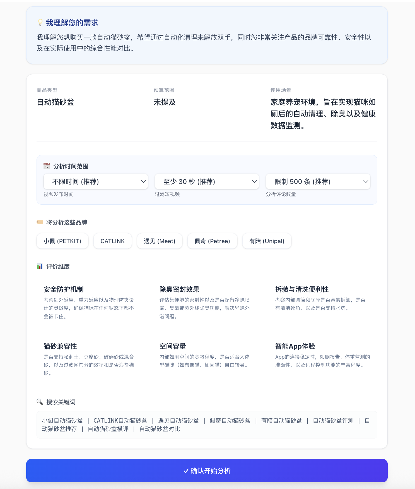</td>
<td>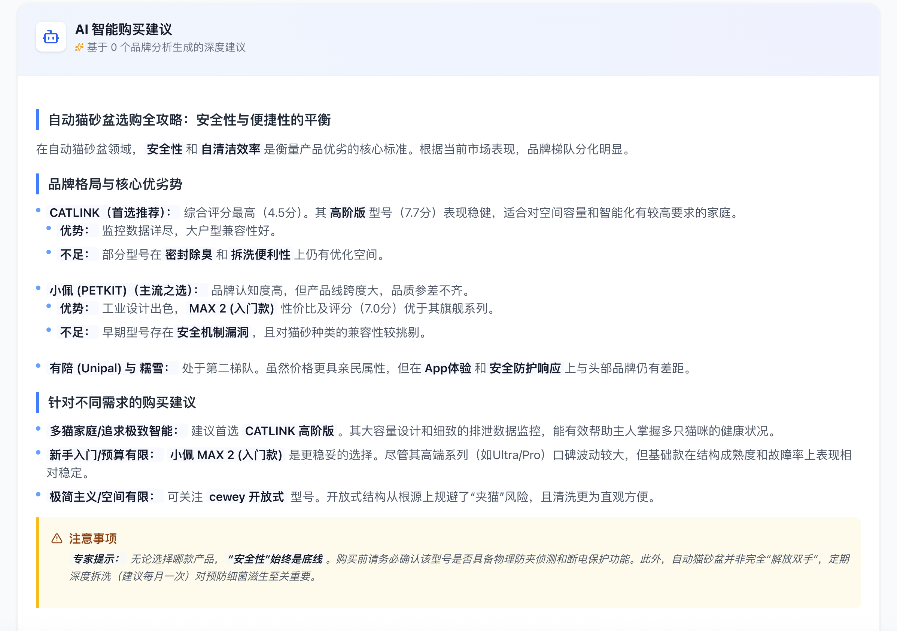</td>
</tr>
<tr>
<td align="center"><strong>首页输入界面</strong></td>
<td align="center"><strong>分析报告界面</strong></td>
</tr>
</table>

<details>
<summary><strong>📸 点击查看更多演示截图</strong></summary>

#### AI 解析确认

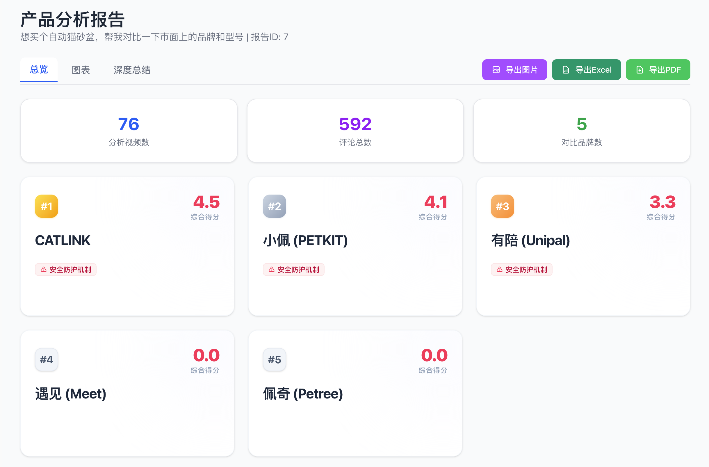

#### 分析进度跟踪

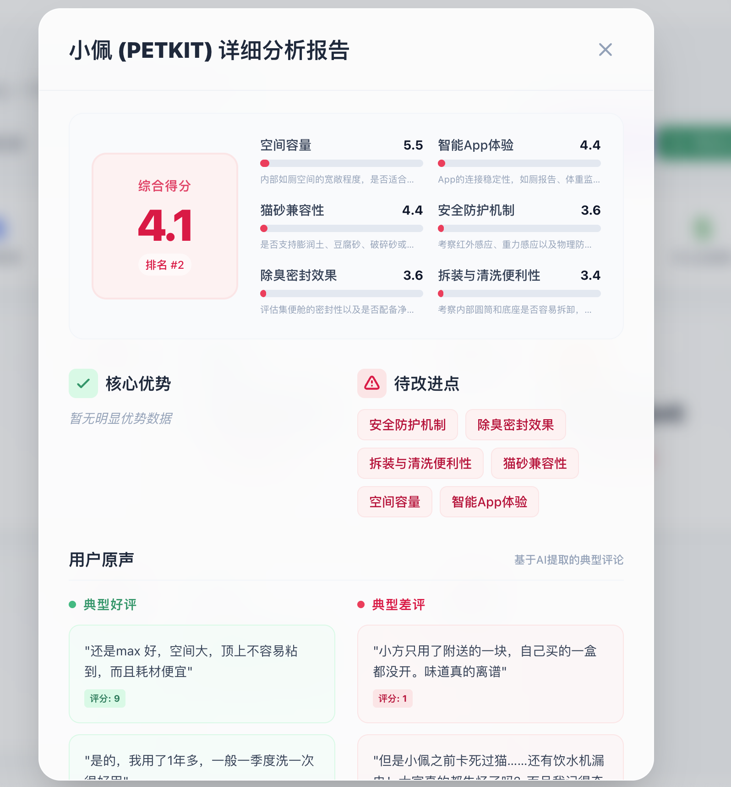

</details>

---

## 系统架构

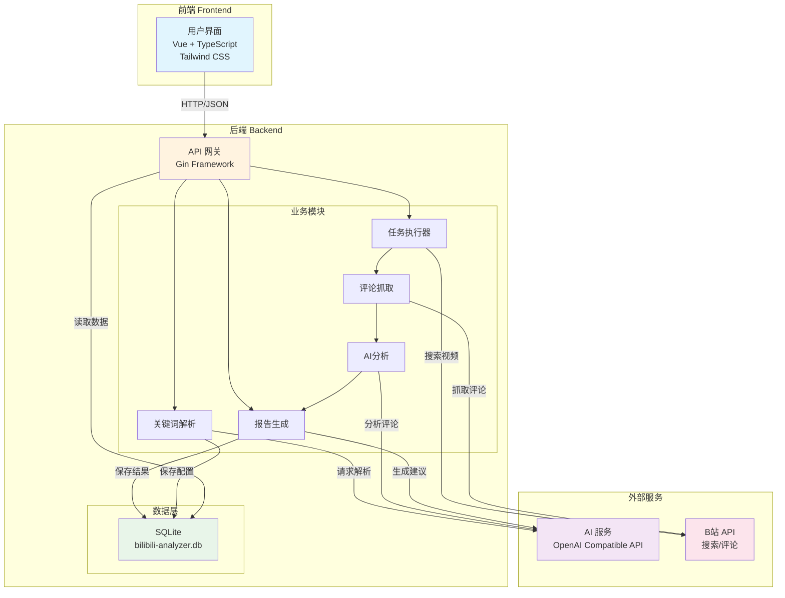

---

## Agent 调用流程

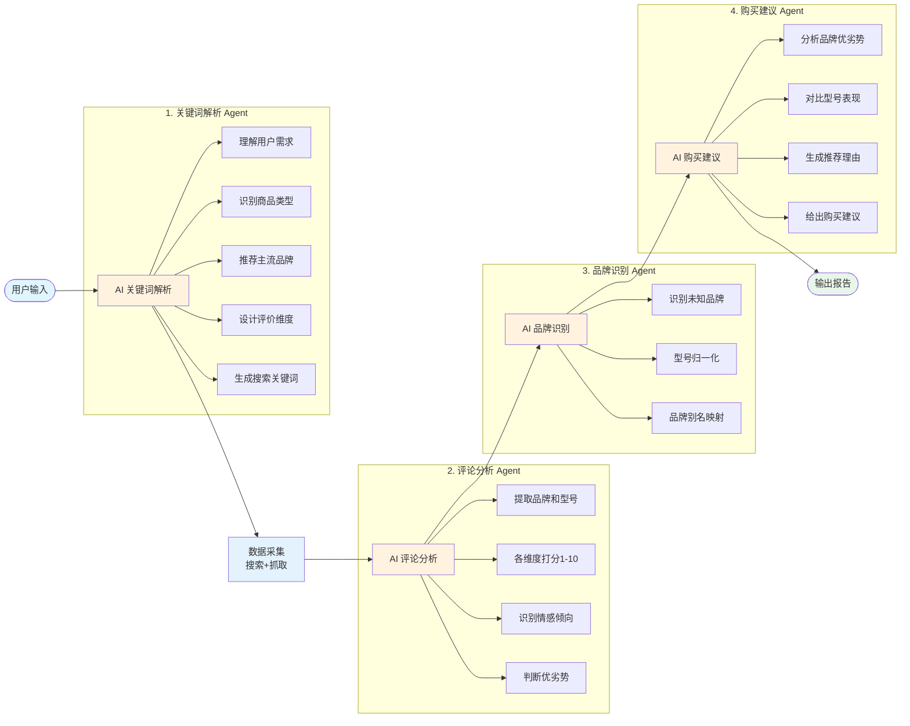

---

## 技术栈

### 后端
| 技术 | 版本 | 用途 |
|------|------|------|
| Go | 1.24.3 | 后端服务语言 |
| Gin | 1.11.0 | Web框架 |
| GORM | 1.31.1 | ORM框架 |
| SQLite | 3 | 数据库 |

### 前端
| 技术 | 版本 | 用途 |
|------|------|------|
| Vue | 3 | UI框架 |
| TypeScript | 5 | 类型安全 |
| Vite | 6 | 构建工具 |
| Tailwind CSS | 4 | 样式框架 |
| Recharts | 2 | 图表库 |
| html2canvas | 1 | 图片导出 |
| xlsx | 0 | Excel导出 |

---

## 目录结构

```
B站商品评论解析/
├── backend/                      # 后端代码
│   ├── main.go                   # 服务入口
│   ├── api/                      # API 路由层
│   │   ├── parse.go              # 需求解析接口
│   │   ├── confirm.go            # 确认启动任务接口
│   │   ├── history.go            # 历史记录接口
│   │   ├── report.go             # 报告查询接口
│   │   └── config.go             # 配置管理接口
│   ├── ai/                       # AI 服务模块
│   │   ├── client.go             # AI 客户端
│   │   ├── keyword.go            # 关键词解析
│   │   ├── analysis.go           # 评论分析
│   │   ├── batch.go              # 批量处理
│   │   └── brand_identify.go     # 品牌识别
│   ├── bilibili/                 # B站 API 模块
│   │   ├── client.go             # HTTP 客户端
│   │   ├── wbi.go                # WBI 签名
│   │   ├── search.go             # 视频搜索
│   │   ├── comment.go            # 评论抓取
│   │   └── scraper.go            # 并发爬虫
│   ├── task/                     # 任务执行模块
│   │   ├── executor.go           # 任务执行器
│   │   └── recovery.go           # 任务恢复
│   ├── report/                   # 报告生成模块
│   │   └── generator.go          # 报告生成器
│   ├── comment/                  # 评论处理模块
│   │   ├── filter.go             # 评论过滤
│   │   └── brand_cleaner.go      # 品牌清洗
│   ├── models/                   # 数据模型
│   │   ├── settings.go           # 配置模型
│   │   ├── analysis_history.go   # 历史记录模型
│   │   ├── raw_comments.go       # 原始评论模型
│   │   └── reports.go            # 报告模型
│   ├── database/                 # 数据库模块
│   │   └── init.go               # 数据库初始化
│   ├── sse/                      # SSE 模块
│   │   ├── manager.go            # 连接管理
│   │   └── handler.go            # 事件处理
│   └── pdf/                      # PDF 导出模块
│       └── generator.go          # PDF 生成器
├── frontend/                     # 前端代码
│   ├── src/
│   │   ├── main.tsx              # 应用入口
│   │   ├── App.tsx               # 根组件
│   │   ├── pages/                # 页面组件
│   │   │   ├── Home.tsx          # 首页
│   │   │   ├── Report.tsx        # 报告页
│   │   │   └── Settings.tsx      # 设置页
│   │   ├── components/           # 业务组件
│   │   │   ├── Report/           # 报告相关组件
│   │   │   │   ├── Overview/     # 总览组件
│   │   │   │   ├── Charts/       # 图表组件
│   │   │   │   ├── VideoSourceList.tsx    # 视频来源展示组件
│   │   │   │   ├── DimensionFilter.tsx    # 维度筛选器
│   │   │   │   ├── BrandDetailModal.tsx   # 品牌详情弹窗
│   │   │   │   ├── ModelAnalysis.tsx      # 型号分析组件
│   │   │   │   ├── CompetitorCompare.tsx  # 竞品对比
│   │   │   │   └── DecisionTree.tsx       # 决策树
│   │   │   │   └── ...
│   │   │   ├── AnalysisForm.tsx  # 分析表单
│   │   │   ├── ConfirmDialog.tsx # 确认对话框
│   │   │   └── ...
│   │   ├── api/                  # API 客户端
│   │   ├── hooks/                # 自定义 Hooks
│   │   └── types/                # 类型定义
│   ├── package.json
│   └── vite.config.ts
├── data/                         # 数据目录
│   └── bilibili-analyzer.db      # SQLite 数据库
├── go.mod                        # Go 依赖配置
├── go.sum
└── README.md
```

---

## 快速开始

### 前置要求

- **Go** 1.24+
- **Node.js** 18+
- **npm** 或 **pnpm**

### 安装步骤

1. **克隆项目**
```bash
git clone https://github.com/ShellMonster/BiliOpinion.git
cd B站商品评论解析
```

2. **安装后端依赖**
```bash
go mod download
```

3. **安装前端依赖**
```bash
cd frontend
npm install
```

4. **启动后端服务**
```bash
go run backend/main.go
# 服务运行在 http://localhost:8080
```

5. **启动前端开发服务器**
```bash
cd frontend
npm run dev
# 访问 http://localhost:5173
```

---

## 配置说明

> 💡 提示：所有配置均可通过前端"设置"页面进行修改，无需重启服务。

### 1. AI 服务配置

首次使用需要配置 AI 服务（支持 OpenAI 或兼容接口）：

| 配置项 | 说明 | 默认值 |
|--------|------|--------|
| AI API Base | API 基础地址 | https://api.openai.com/v1 |
| AI API Key | API 密钥 | - |
| AI Model | 使用的模型 | gemini-3-flash-preview |

**模型选择建议**：

- 本项目兼容所有 OpenAI 格式的 API，理论上 **2025 年及以后发布的模型**均可使用
- 优先选择 **发布时间更接近当前** 的模型，技术更新、效果更好
- 根据自己的 **成本预算** 选择合适的模型：
  - 免费或低成本：Gemini 3 Flash（推荐）、DeepSeek 等国内模型
  - 中等成本：GPT-5.1 Instant、Claude 4 Haiku 等
  - 高性能需求：GPT-5.2、Gemini 3 Pro、Claude Opus 4.5 等
- 推荐配置：`gemini-3-flash-preview`（速度快、成本低、效果稳定）

**2025年主要模型发布**：
- **GPT-5**（2025年8月）、**GPT-5.1**（2025年11月）、**GPT-5.2**（2025年12月）
- **Gemini 3** / Gemini 3 Flash / Gemini 3 Pro（2025年11月）
- **Claude Opus 4.5**（2024年11月）

### 2. 并发配置

| 配置项 | 说明 | 默认值 | 范围 |
|--------|------|--------|------|
| 抓取并发数 | B站API并发请求数 | 5 | 1-10 |
| AI并发数 | AI分析并发请求数 | 10 | 1-20 |

> ⚠️ 注意：并发数过高可能触发B站反爬机制或API频率限制，建议保持默认值

### 3. B站 Cookie 配置

从浏览器复制 B站 Cookie：

1. 访问 https://www.bilibili.com 并登录
2. 按 F12 打开开发者工具
3. 切换到 "Network" 标签，刷新页面
4. 找到任意请求，复制请求头中的完整 Cookie 字符串

### 4. 任务配置（可选）

| 配置项 | 说明 | 默认值 |
|--------|------|--------|
| 每个关键词最大视频数 | 搜索视频数量限制 | 20 |
| 每个视频最大评论数 | 抓取评论数量限制 | 200 |
| 最小视频评论数 | 过滤评论数少的视频 | 0 |
| 每视频最少抓取 | 确保每个视频至少抓取 | 20 |
| 每视频最多抓取 | 防止单视频评论过多 | 200 |
| AI 批次大小 | AI 分析批次大小 | 10 |
| 视频时间范围（月） | 过滤旧视频，0 表示不限制 | 0 |
| 最小视频时长（秒） | 过滤短视频 | 30 |
| 最大分析评论数 | 分析评论总数限制 | 500 |

**智能分配算法**：系统会根据视频的评论数按比例分配抓取数量，避免热门视频评论过多导致数据倾斜，同时确保每个视频至少抓取指定数量的评论。

---

## API 文档

### 解析需求

```http
POST /api/parse
Content-Type: application/json

{
  "requirement": "想买个无线吸尘器，预算2000元，家里有宠物"
}
```

**响应示例：**
```json
{
  "understanding": "我理解您想购买一款...",
  "product_type": "无线吸尘器",
  "budget": "2000元左右",
  "scenario": "家庭使用",
  "special_needs": ["宠物毛发清理"],
  "brands": ["戴森", "小米", "石头", "美的", "追觅"],
  "dimensions": [
    {"name": "吸力性能", "description": "评估吸尘器的吸力大小和对宠物毛发的清洁效果"},
    {"name": "续航时间", "description": "电池续航能力，一次充电能清洁多大面积"},
    {"name": "噪音控制", "description": "运行时的噪音水平"},
    {"name": "过滤系统", "description": "HEPA过滤效果，防止二次污染"},
    {"name": "配件丰富度", "description": "附带的各种刷头和配件"},
    {"name": "性价比", "description": "综合价格和性能的评估"}
  ],
  "keywords": [
    "戴森吸尘器",
    "小米吸尘器",
    "石头吸尘器",
    "无线吸尘器评测",
    "无线吸尘器推荐",
    "无线吸尘器横评",
    "无线吸尘器对比"
  ]
}
```

### 启动任务

```http
POST /api/confirm
Content-Type: application/json

{
  "requirement": "无线吸尘器",
  "brands": ["戴森", "小米", "石头"],
  "dimensions": [
    {"name": "吸力性能", "description": "评估吸尘器的吸力大小"}
  ],
  "keywords": ["戴森吸尘器", "无线吸尘器评测"]
}
```

**响应示例：**
```json
{
  "task_id": "task_1738425600_abc123",
  "message": "任务已启动"
}
```

### SSE 进度推送

```http
GET /api/sse?task_id=<task_id>
```

**事件流示例：**
```
data: {"status":"searching","message":"正在搜索: 戴森吸尘器 (1/7)","progress":10}

data: {"status":"scraping","message":"开始抓取50个视频的评论...","progress":25}

data: {"status":"analyzing","message":"正在AI分析 500 条评论...","progress":60}

data: {"status":"generating","message":"正在生成AI购买建议...","progress":95}

data: {"status":"completed","message":"分析完成！共分析50个视频，500条评论","progress":100,"stage":"123"}
```

### 其他接口

| 接口 | 方法 | 说明 |
|------|------|------|
| /api/history | GET | 获取历史记录列表 |
| /api/history/:id | GET | 获取历史记录详情 |
| /api/history/:id | DELETE | 删除历史记录 |
| /api/report/:id | GET | 获取报告详情 |
| /api/report/:id/pdf | GET | 导出 PDF 报告 |
| /api/config | GET | 获取配置（含AI、B站Cookie、并发配置） |
| /api/config | POST | 保存配置 |

### 配置管理接口

#### 获取配置
```http
GET /api/config
```

**响应示例：**
```json
{
  "ai_base_url": "https://api.openai.com/v1",
  "ai_api_key": "sk-...",
  "ai_model": "gemini-3-flash-preview",
  "bilibili_cookie": "SESSDATA=xxx;...",
  "scrape_max_concurrency": "5",
  "ai_max_concurrency": "10"
}
```

#### 保存配置
```http
POST /api/config
Content-Type: application/json

{
  "ai_base_url": "https://api.openai.com/v1",
  "ai_api_key": "sk-...",
  "ai_model": "gemini-3-flash-preview",
  "bilibili_cookie": "SESSDATA=xxx;...",
  "scrape_max_concurrency": "5",
  "ai_max_concurrency": "10"
}
```

**响应示例：**
```json
{
  "message": "配置已保存"
}
```

---

## 评分体系与策略

<details>
<summary><strong>📖 点击展开查看详细的评分策略和算法逻辑</strong></summary>

### 评分标准

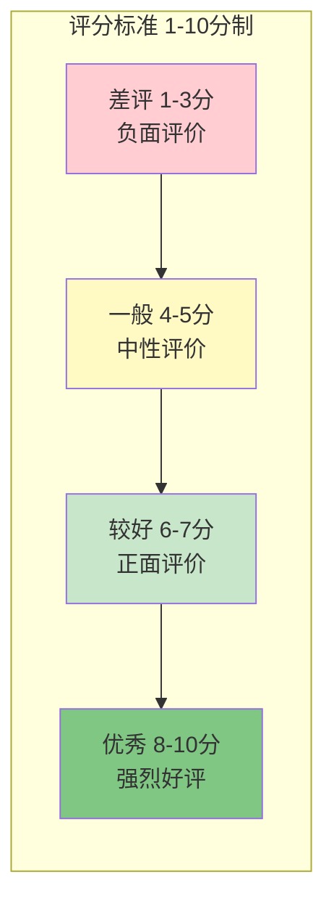

### 评分策略流程

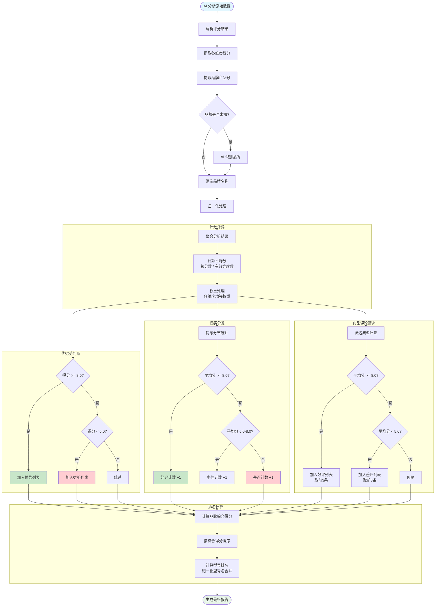

### 策略规则详解

#### 1. 优劣势判断规则

| 得分范围 | 分类 | 说明 |
|----------|------|------|
| >= 8.0 分 | 优势 | 该维度表现优秀 |
| 6.0 - 7.9 分 | 一般 | 该维度表现正常 |
| < 6.0 分 | 劣势 | 该维度存在不足 |

#### 2. 情感分类规则

| 平均得分 | 情感分类 | 说明 |
|----------|----------|------|
| >= 8.0 分 | 好评 | 正面评价 |
| 5.0 - 7.9 分 | 中性 | 一般评价 |
| < 5.0 分 | 差评 | 负面评价 |

#### 3. 典型评论筛选规则

| 类型 | 条件 | 数量 |
|------|------|------|
| 典型好评 | 平均得分 >= 8.0 | 每品牌前 3 条 |
| 典型差评 | 平均得分 < 5.0 | 每品牌前 3 条 |

#### 4. 品牌排名计算

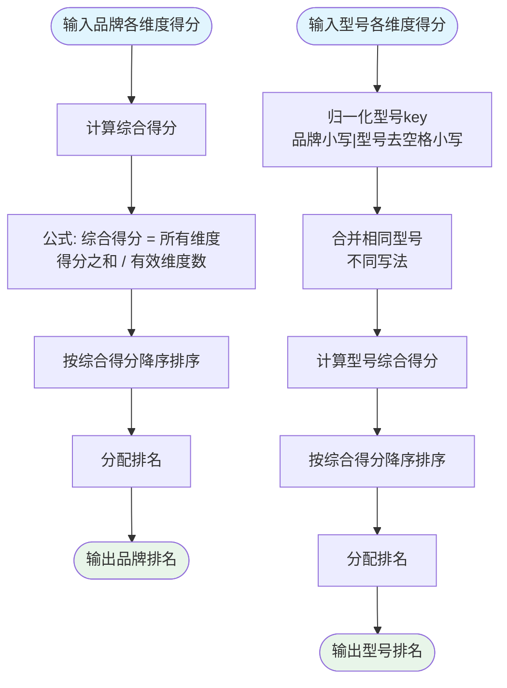

#### 5. 型号归一化规则

为合并相同型号的不同写法，系统使用归一化 key 进行聚合：

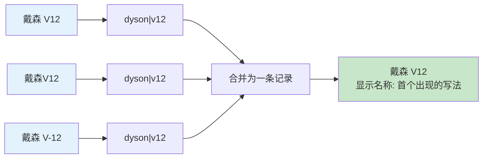

**归一化规则**：
- 品牌名转小写
- 型号名转小写，移除空格、连字符、下划线
- 格式：`品牌小写|型号处理后`

### 评论质量评分策略

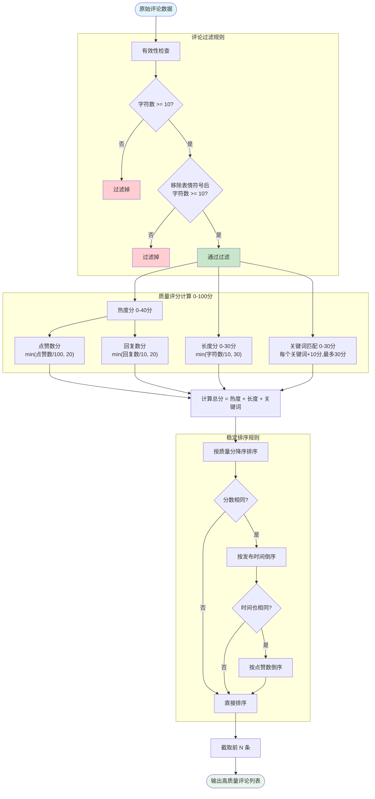

**评论质量评分规则**：

| 评分项 | 权重 | 计算公式 | 最高分 |
|--------|------|----------|--------|
| 热度分 | 40% | min(点赞数/100, 20) + min(回复数/10, 20) | 40 分 |
| 长度分 | 30% | min(字符数/10, 30) | 30 分 |
| 关键词分 | 30% | 每匹配一个关键词 +10 分 | 30 分 |

**过滤规则**：
- 最小字符数：10 个字符（按 rune 计数）
- 移除表情和符号后，可读内容仍需 >= 10 个字符
- 过滤纯表情/符号评论

**排序规则**（确定性稳定排序）：
1. 质量分降序
2. 发布时间倒序（新评论优先）
3. 点赞数倒序
4. 评论 ID 倒序

### 时间相关策略

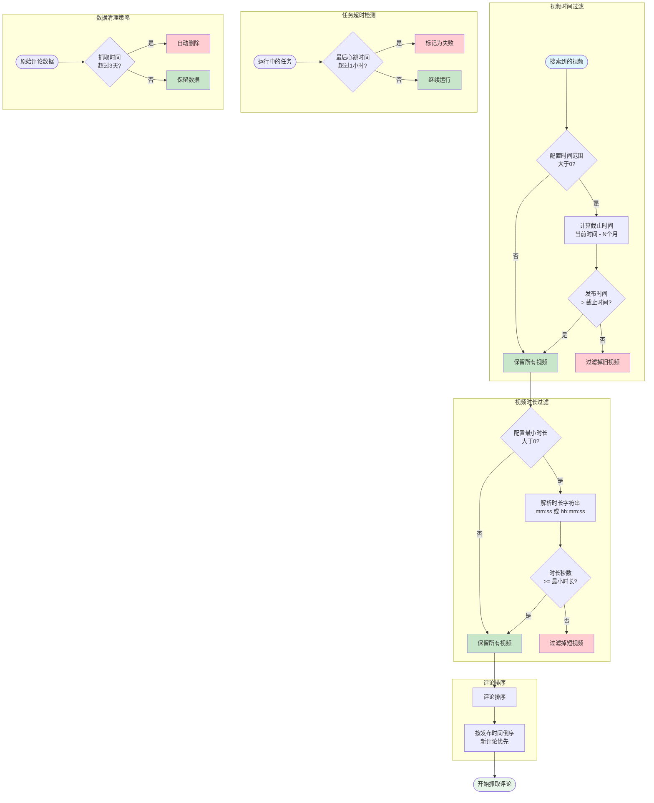

**时间相关策略详解**：

| 策略类型 | 配置项 | 默认值 | 说明 |
|----------|--------|--------|------|
| 视频时间过滤 | VideoDateRangeMonths | 0（不限制） | 只保留最近 N 个月内发布的视频 |
| 视频时长过滤 | MinVideoDuration | 30 秒 | 过滤掉时长不足的短视频 |
| 评论排序 | - | 按发布时间倒序 | 新评论优先，相同时间按点赞数 |
| 任务超时 | - | 1 小时无心跳 | 超过 1 小时无心跳则标记失败 |
| 数据清理 | - | 3 天 | 原始评论数据 3 天后自动删除 |

**WBI 密钥缓存**：B站 API 的 WBI 签名密钥缓存 1 小时，避免频繁获取

</details>

---

## 常见问题

### Q: B站 Cookie 过期怎么办？

A: Cookie 一般有效期约 30 天，过期后需要重新获取。步骤：登录 B站 → F12 开发者工具 → Network → 复制 Cookie

### Q: AI 分析成本如何控制？

A: 推荐使用 Google Gemini `gemini-3-flash-preview` 模型，速度快且成本低。同时可以通过调整 `最大分析评论数` 参数控制调用次数。

### Q: 评论抓取失败怎么办？

A: 可能原因：
- Cookie 过期或无效
- 搜索关键词没有相关视频
- 触发 B站反爬限制（可降低并发数）

### Q: 如何提高分析准确性？

A: 建议：
- 增加搜索关键词数量
- 选择热门、播放量高的视频
- 确保评论数量充足（建议 100+ 条）

---

## 致谢

本项目在实现 B站 API 调用和数据加解密功能时，参考了以下开源项目：

- [bilibili-API-collect (pskdje)](https://github.com/pskdje/bilibili-API-collect) - B站 API 文档和 WBI 签名实现
- [bilibili-API-collect (SocialSisterYi)](https://github.com/SocialSisterYi/bilibili-API-collect) - 原始 B站 API 收集项目

感谢这些项目为开发者社区整理和维护 B站 API 文档。特别感谢原作者 SocialSisterYi 的贡献，以及 pskdje 在原项目因不可抗力删除后继续维护相关内容。

---

## 许可证

MIT License

---

**让真实的用户评价帮助你做出更明智的购买决策！**
